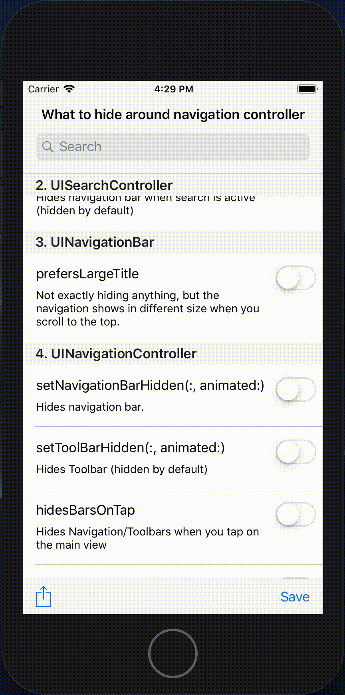

## Overview
`UINavigationController`周りで、調整したり隠したりできるオプションは結構沢山あります。例えば、 `UINavigationController.setNavigationBarHidden（true :, animated：true）`を呼び出すとナビゲーションバーが隠れます。あるいは、 `UINavigationController.hidesBarsOnTap = true`を選択してメインビューをタップすると、ナビゲーションバーと下部ツールバー（存在する場合）の両方が非表示になります。

このレポジトリは、それらの非表示アクションを要約することを目的としています。(2019/01/11 現在)

例 : 


## `UINavigationController`
### `setNavigationBarHidden(:, animated:)`
`navigationController？.setNavigationBarHidden（true、animated：true）`を呼び出すことでナビゲーションバーを隠すことができます。

### `setToolBarHidden(:, animated:)`
`navigationController？.setToolbarHidden（true、animated：true）`を呼び出すことで下部のツールバーを隠すことができます。

ただし、ツールバーはデフォルトで非表示になっているので、明示的に指定する必要はありません。ツールバーを表示するには、ツールバーに `BarButtonItems`を設定する必要があります。例えば、

```
let actionItem = UIBarButtonItem(barButtonSystemItem: .action, target: nil, action: nil)
let spacerItem = UIBarButtonItem(barButtonSystemItem: .flexibleSpace, target: nil, action: nil)
let saveItem = UIBarButtonItem(barButtonSystemItem: .save, target: nil, action: nil)
toolbarItems = [actionItem, spacerItem, saveItem]

navigationController?.setToolbarHidden(false, animated: false)
```
としてやります。

### `hidesBarsOnTap`
`navigationController？.hidesBarsOnTap = true`を設定した後にメインビューをタップすると、ナビゲーションバーとツールバーの両方が切り替わります。

### `hidesOnSwipe`
`navigationController？.hidesOnSwipe = true`を設定した後に画面の下から上にスワイプをすると、ナビゲーションバーとツールバーの両方が非表示になります。ただし、期待に反して、スワイプダウンをしてもバーは元に戻りません。すなわち一旦バーを隠すと、バーは二度と戻って来なくなります。これが期待通りの動作なのかiOSのバグなのかわかりませんが、これについて不満を言っているStackoverflow の投稿は結構あります。 例：https://stackoverflow.com/questions/32992897/hidesbarsonswipe-does-not-show-navigationbar-when-scrolling-up-to-the-top-slowly）

1つの回避策は、(スクロールビューとして　`UITableView` を使っている場合)一番上の行が表示されたときにそれらを再度表示することです。

```
    func tableView(_ tableView: UITableView, willDisplay cell: UITableViewCell, forRowAt indexPath: IndexPath) {
        if (indexPath.section == 0 && indexPath.row == 0) {
            navigationController?.hidesBarsOnSwipe = false
            navigationController?.setNavigationBarHidden(false, animated: true)
            navigationController?.setToolbarHidden(false, animated: true)
        } else {
            navigationController?.hidesBarsOnSwipe = true
        }
    }
```

### `hidesBarsWhenVerticallyCompact`
`navigationController？.hidesBarsWhenVerticallyCompact = true`を設定した後にデバイスを横向きに回転させると、ナビゲーションバーとツールバーの両方が隠れます。縦向きに戻すと元に戻ります。

### `hidesBarsWhenKeyboardAppears`
`navigationController？.hidesBarsWhenKeyboardAppears = true`を設定した後にキーボードを起動すると、ナビゲーションバーとツールバーの両方が非表示になります。しかし、期待に反して、キーボードを収納しても元には戻りません。このデモでは、 `UITextFieldDelegate.textFieldShouldReturn（_ :)`をキャプチャして手動でバーを元に戻します。

```
    navigationController?.setNavigationBarHidden(false, animated: true)
    navigationController?.setToolbarHidden(false, animated: true)
```

もう 1つの落とし穴は、このフラグを `true`に設定すると、あとでフラグを`false`に設定した後も `true` である時の動作が持続することです。これはiOSのバグだと思いますが、このフラグを `UIViewController`の有効期間内に切り替えるのはあまり一般的ではないので、実際に問題になることはあまりないのでしょう。

また、 `UINavigationItem.searchController` を設定してナビゲーションバーの下に検索バーを実装した時は、このフラグを `true` に設定しないこと。何かを検索しようとすると、キーボードがポップアップして、ナビゲーションバーを隠しますが、検索バーもナビゲーションバーの一部なので、検索バー自体が見えなくなります。検索したいのに検索バーが見えないというよくわからない状態になってしまいます。このデモはサンプラーなのでこの禁忌を犯していて、おかしな挙動が見られます。

## `UINavigationBar`
### `hidesSearchBarWhenScrolling`
`navigationItem.searchController`を設定することで、検索バーをナビゲーションバーの下に実装していると仮定します。 `navigationItem.hidesSearchBarWhenScrolling = true`を設定した後にスクロールビューを上にスクロールすると、ナビゲーションバーの下の検索バーは折りたたまれます。スクロールビューを下にスクロールすると、拡大して再び表示されます。デフォルト値は `true`です。したがって、検索バーを常に保持したい場合は、逆にこれを `false`に設定してください。

## `UISearchController`
### `hidesNavigationBarDuringPresentation`
`navigationItem.searchController`を設定することで、検索バーをナビゲーションバーの下に実装していると仮定します。 `navigationItem.searchController.hidesNavigationBarDuringPresentation = true`を設定した後に検索バーをタップすると、ナビゲーションバーは非表示になり、検索バーのみが上部に表示されます。デフォルト値は `true`ですので、検索をしている間ナビゲーションバーをキープしたい場合は、逆にこれを `false`に設定してください。

## `UIViewController`
### `prefersStatusBarHidden`
この computed variable をオーバーライドして　`true` を返すと、ステータスバーは非表示になります。

```

var statusBarHidden = false

override var prefersStatusBarHidden: Bool {
    return statusBarHidden
}

...

    statusBarHidden = true
    setNeedsStatusBarAppearanceUpdate()
```

オーバーライドした computed variable を呼び出してレンダリングを行うためには `setNeedsStatusBarAppearanceUpdate()` を呼び出す必要があるというところは一つのポイントです。また、この設定は  iPhone Xのような端から端までのデバイスでは動作せず、ステータスバーは常に表示されています。おそらく、そもそもノッチ領域にあるステータスバーを隠すのは意味がないということだと思います（ナビゲーションバーがノッチ領域と重なってしまうのでおかしな見栄えになる）

### `homeIndicatorAutoHidden`
この computed variable をオーバーライドして `true` を返すと、iPhone X などの edge-to-edge のディスプレイで、ホームボタンの場所を示す細くて白いバーが消えます。

```

var homeIndicatorAutoHidden = false

override var prefersHomeIndicatorAutoHidden: Bool {
    return homeIndicatorAutoHidden
}

...

    homeIndicatorAutoHidden = true
    setNeedsUpdateOfHomeIndicatorAutoHidden()
```

オーバーライドした computed variable を呼び出してレンダリングを行うためには `setNeedsUpdateOfHomeIndicatorAutoHidden（）`を呼び出す必要があります。

## `UINavigationBar`
### `prefersLargeTitle`
`self.navigationController？.navigationBar.prefersLargeTitles = true` としてスクロールビューを上にスクロールするとナビゲーションバーが小さくなり、下にスクロールするとナビゲーションバーが大きく表示されます。この動作は何かを隠しているという訳ではないけれども、類似の特筆すべき振る舞いとしてリストしました。
